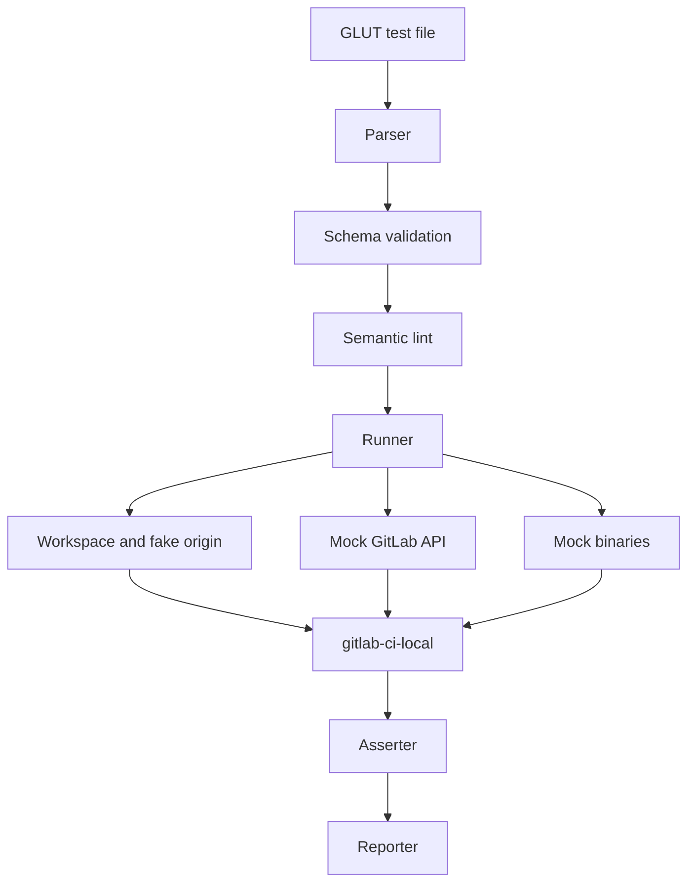

# GLUT

GLUT is a CLI tool for testing GitLab CI components locally. It runs a normal
GitLab CI pipeline with `gitlab-ci-local`. It adds isolated git state, mock
GitLab API behavior, mock binaries, and structured asserts.

Use GLUT when a component needs more than a simple shell test. Common cases are
image build jobs, manifest update jobs, release jobs, and jobs that call the
GitLab API.

## Basic Test Shape

A GLUT test has two YAML documents:

1. A GitLab CI pipeline.
2. A `.glut:` metadata document.

```yaml
stages:
  - test

test-job:
  stage: test
  script:
    - echo "ok"
---
.glut:
  name: "basic test"
  setup:
    branch: "main"
  assert:
    job:
      test-job:
        exit-status: 0
        stdout:
          - "ok"
```

The first document is passed to `gitlab-ci-local`. The second document is owned
by GLUT.

## Architecture



The runner coordinates the full test. Parser, schema validation, workspace
setup, execution, assertions, and reports stay in separate packages.

## Main Commands

```bash
glut run ./tests
glut list ./tests
glut lint ./tests
glut version
```

## Project State

GLUT is still in early implementation. The public test format may still change
before the first stable release.
